## MSE Grad Descent
https://www.deep-ml.com/problems/47?from=Deep%20Learning

### Batch Gradient Descent

  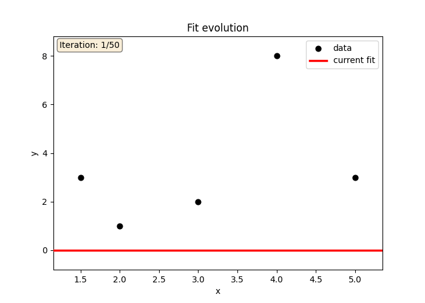
  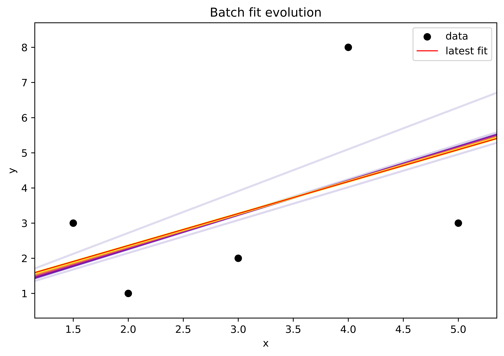

  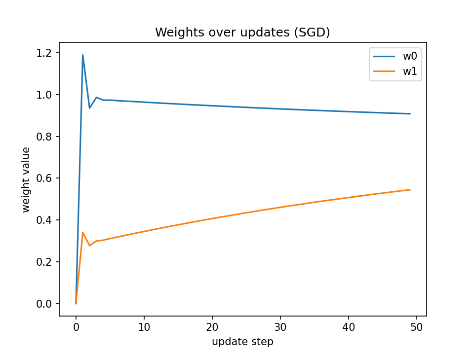
  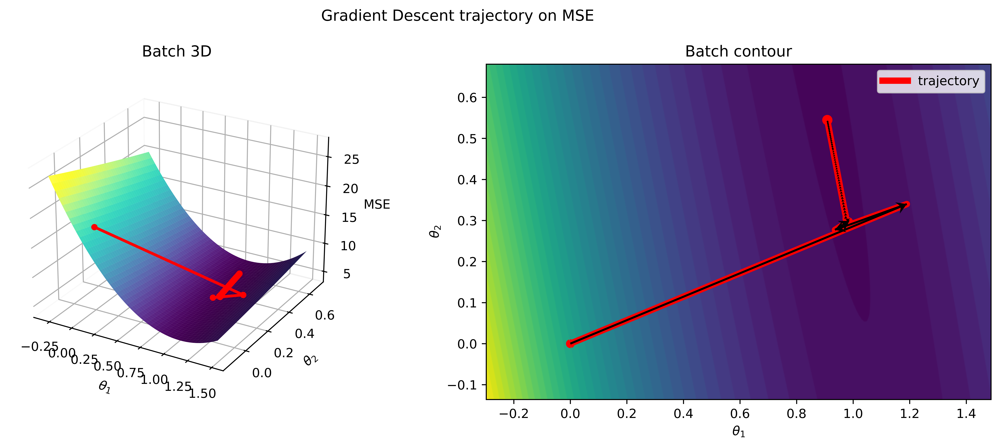

### Mini-Batch Gradient Descent

  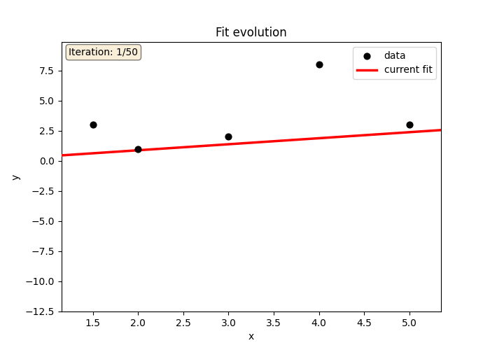
  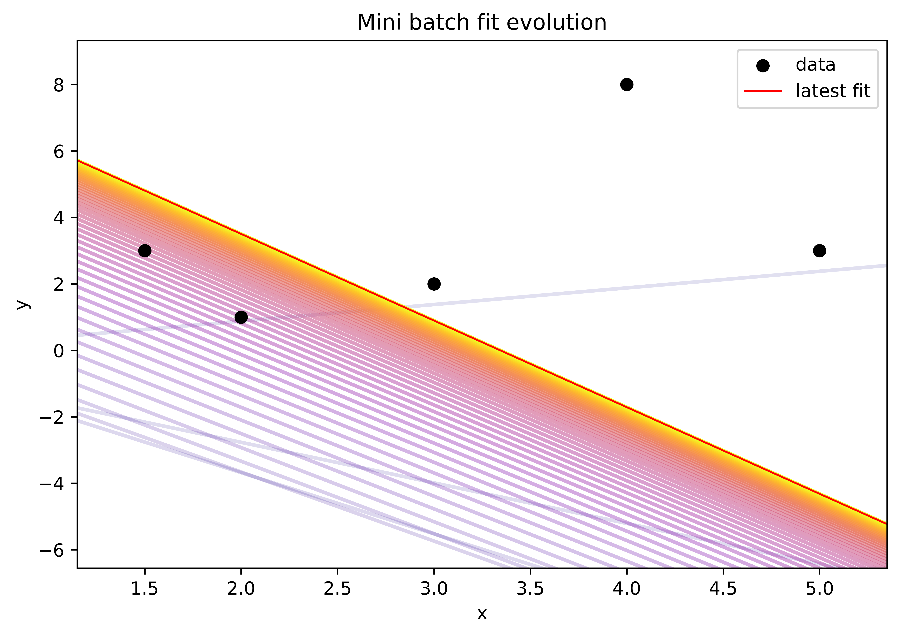

  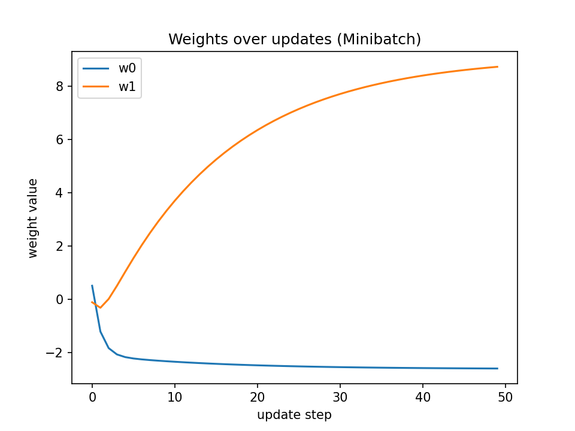
  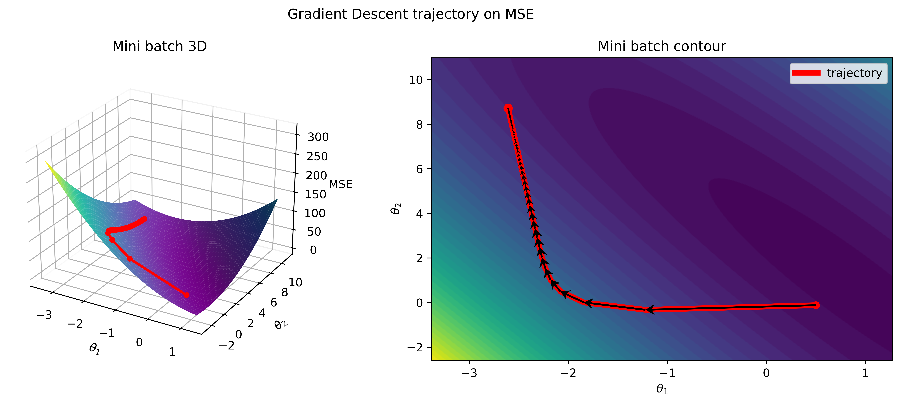

### SGD Gradient Descent

  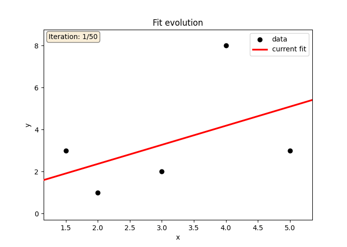
  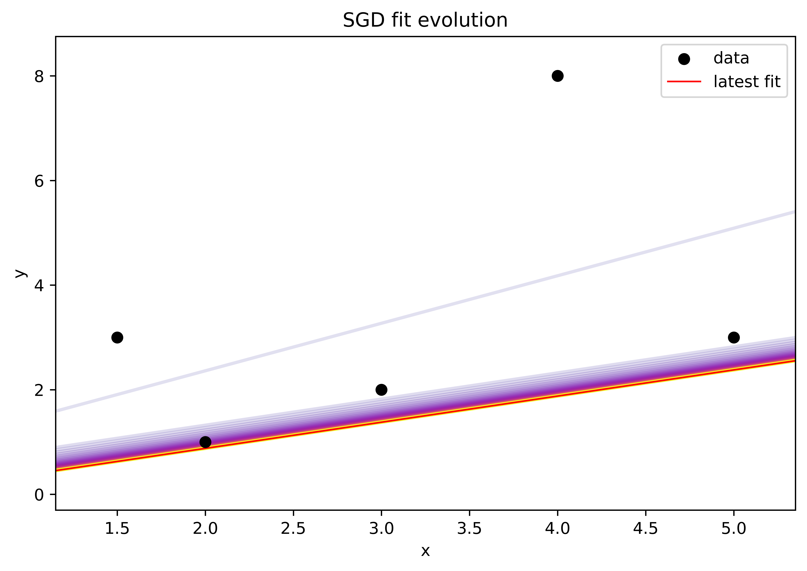

  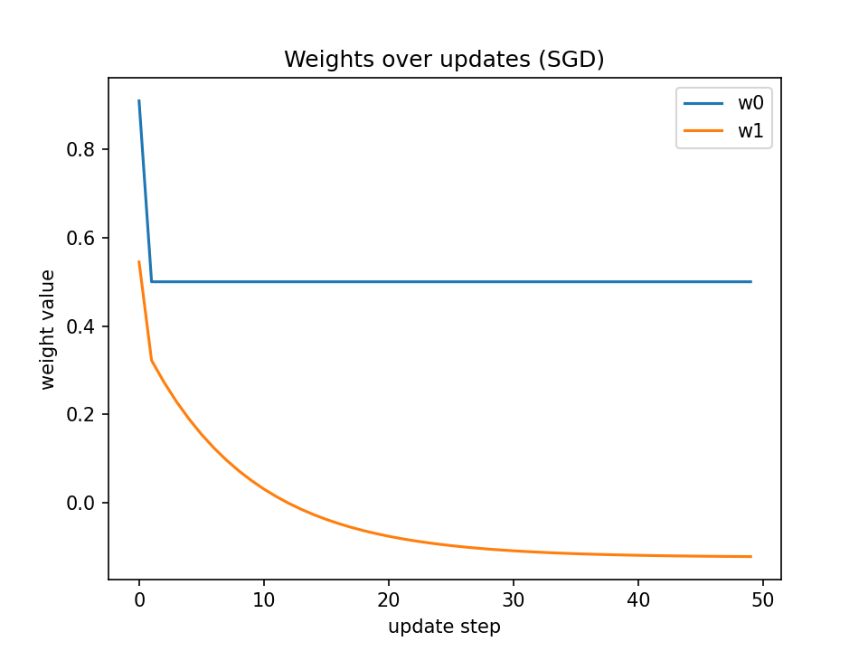
  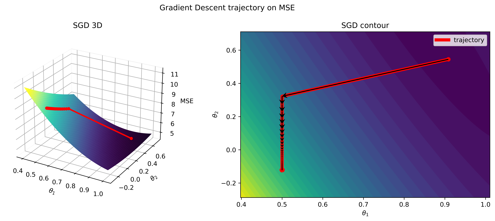

